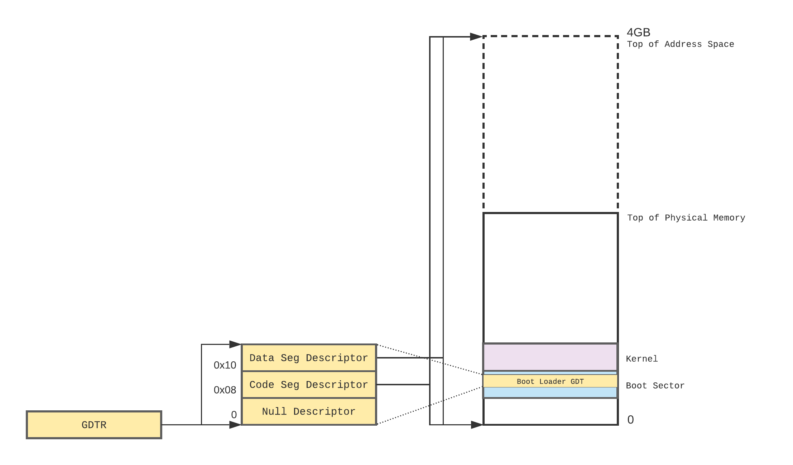

# Switching to Protected Mode

To switch to 32-bit protected mode we need to do the following:
1. Set up a GDT. We'll create only two segment descriptors: one for code and another for data. Both will be flat memory model segments.
2. Disable interrupts.
3. Load the GDT base address and size into the `gdtr` register.
4. Set the Protected Mode bit in the `cr0` register.
5. Perform a far jump to load the `cs` register with our code descriptor and begin executing in protected mode.

Remember that we're doing this as a temporary measure just to be able to transfer control to a 32-bit kernel. Once the kernel takes over, it will setup its own GDT, among other initialization tasks.

### Set up the GDT

The following diagram illustrates the memory layout and the contents of the GDT we need to setup.



There are a few things to note here:
* The first entry in the GDT must be a null descriptor (i.e. all zeros). This descriptor is used by the CPU to prevent usage of uninitialized segment selectors.
* A segment is referred to through a _segment selector_, which is the _index_ of that segment's descriptor in the GDT. In this case, we would refer to the code segment using the segment selector `0x08`, and to the data segment using the selector `0x10`.
* We'll declare the GDT inside our boot sector, and load its base address and size into the `gdtr` register using the `lgdt` instruction (Load GDT) to let the CPU know where to find the GDT.
* Although the code and data segments cover the entire address space, we can only address up to the limits of physical memory[^1].

[^1]: This won't be an issue when we start using virtual memory, i.e. paging.

Let's create a separate assembly file for declaring the GDT:

```
;   gdt.asm

gdt_start:         ; 0x00
    ; null descriptor
    dd 0x00000000
    dd 0x00000000

gdt_code:          ; 0x08
    ; code segment descriptor
    dw 0xffff      ; limit (bits 00-15)
    dw 0x0000      ; base address (bits 00-15)
    db 0x0         ; base address (bits 16-23)
    db 10011010b   ; access rights
    ;  ||||| |+----- A:0       not accessed
    ;  ||||+-+------ TYPE:101  code, execute/read
    ;  |||+--------- S:1       code, data, or stack
    ;  |++---------- DPL:00    privilege level 0
    ;  +------------ P:1       present
    db 11001111b   ; flags + limit bits
    ;  |||||  |
    ;  ||||+--+----- limit (bits 16-19)
    ;  |||+--------- AVL:0     available to user
    ;  ||+---------- L:0       not 64-bit code segment
    ;  |+----------- D/B:1     default operand size is 32-bit
    ;  +------------ G:1       limit granularity is 4KB
    db 0x0         ; base address (bits 24-31)

gdt_data:          ; 0x10
    ; data segment descriptor
    dw 0xffff      ; limit (bits 00-15)
    dw 0x0000      ; base address (bits 00-15)
    db 0x0         ; base address (bits 16-23)
    db 10010010b   ; access rights
    ;  ||||| |+----- A:0       not accessed
    ;  ||||+-+------ TYPE:001  data, read/write
    ;  |||+--------- S:1       code, data, or stack
    ;  |++---------- DPL:00    privilege level 0
    ;  +------------ P:1       present
    db 11001111b   ; flags + limit bits
    ;  |||||  |
    ;  ||||+--+----- limit (bits 16-19)
    ;  |||+--------- AVL:0     available to user
    ;  ||+---------- L:0       not 64-bit code segment
    ;  |+----------- D/B:1     big data segment; offsets are 32-bit
    ;  +------------ G:1       limit granularity is 4KB
    db 0x0         ; base address (bits 24-31)

gdt_descriptor:
  dw $ - gdt_start - 1 ; limit (one less than size)
  dd gdt_start
```

Segment descriptors can be intimidating due to their complex and unintuitive structure[^2]. Hopefully the heavily commented code is self-explanatory. The most important parts I want to highlight are:

* segment base address (`0x0`),
* segment limit (`0xFFFFFFFF`),
* descriptor privilege level (`0`)
* segment type (code vs. data)
* code segment access is execute/read
* data segment access is read/write

[^2]: For a complete description of segment descriptors you can refer to the Intel [software development manuals](https://software.intel.com/content/www/us/en/develop/articles/intel-sdm.html) or [Wikipedia](https://en.wikipedia.org/wiki/Segment_descriptor).

At the end we declare the GDT descriptor itself (which is to be loaded into the `gdtr` register), which consists of the GDT limit and base address.

### Switching to Protected Mode

OK, it's time to load our GDT and switch to protected mode:

```
    ...

    ;
    ; load a one-sector dummy kernel
    ;
    ...
  
    ;
    ; switch to protected mode
    ;
    cli                          ; disable interrupts
    lgdt   [gdt_descriptor]      ; load the GDT descriptor
    mov    eax, cr0
    or     eax, 0x1              ; set Protected Mode Enable (PE) bit in cr0
    mov    cr0, eax
    jmp    0x08:pm_entry         ; far jump to load code seg selector

[bits 32]
pm_entry:

    ...

[bits 16]
%include "gdt.asm" 

    times 510-($-$$) db 0
    db     0x55, 0xAA
```

This code disables interrupts, loads the GDT descriptor into `gdtr`, enables the protected mode bit in `cr0`, and performs a far jump to the next instruction to load the `cs` register with our new code segment selector (`0x08`). Note the `[bits 32]` directive at the protected mode entry point to tell NASM to start emitting 32-bit code from this point on. We include the `gdt.asm` file towards the end so that it gets assembled with the boot sector code, which also resolves the `gdt_descriptor` symbol.

Also note that we perform the switch to protected mode _after_ we load our kernel, since BIOS services are not available in protected mode. From this point on we have to interact with hardware directly on our own.

At this point only the `cs` segment register has been loaded with the code segment selector. We need to do the same with all the data segment registers (`ds`, `es`, `fs`, and `gs`) and the stack segment register (`ss`):

```
[bits 32]
pm_entry:
    ;
    ; we're in protected mode; load the data segment registers
    ;
    mov ax, 0x10                 ; data segment selector
    mov ds, ax
    mov es, ax
    mov fs, ax
    mov gs, ax
    mov ss, ax
```

One last thing we need to change is the target address of the kernel to jump to. Initially we had it as a real mode address `0x0000:0x7E00`, which is not applicable anymore in protected mode. We need to change the kernel entry point to a protected mode address:

```
    ;
    ; jump to kernel
    ;
    jmp    0x08:0x7E00
```

### Outputting to screen in protected mode

We can't test this just yet because our kernel still uses the BIOS to display a character on screen. We'll need to modify this so that the kernel outputs the character by writing directly to video memory.

Text mode video memory starts at `0xB8000`. Each character on screen is made up of 16-bit value: the low byte represents the ASCII character itself, and the high byte represents the character's attributes, particulary its foreground and background colors[^3].

[^3]: https://en.wikipedia.org/wiki/VGA_text_mode

We're going to output the `K` character at the beginning of video memory, which translates to the top-left position of the screen. It would be nicer if we can output the character at the current cursor position (which is right after the `B` character output by the boot sector), but in order to do that we'll need to read the current cursor position through a VGA hardware ports. Eventually we'll be able to do that, but let's keep it simple for now.

Here's our new dummy kernel:

```
;   kernel.asm

VIDEO_MEMORY         equ 0xb8000
LIGHTGRAY_ON_BLACK   equ 0x07

[bits 32]

    mov    al, 'K'                  ; low byte: character
    mov    ah, LIGHTGRAY_ON_BLACK   ; high byte: color/attributes
    mov    [VIDEO_MEMORY], eax      ; output to start of video memory

    cli
    hlt

    times 512-($-$$) db 0
```

### Putting it all together

Let's put everything together and test our protected mode kernel.

```
$ nasm -o bootsect.img bootsect.asm
$ cat bootsect.img kernel.img > os.img
$ qemu -drive file=os.img,format=raw
```
```
K aBIOS (version ...)
Booting from Hard Disk...
B
```

Great! We can see the `K` character at the top-left of the screen, just as we intended (the rest of the line is just the original BIOS boot version message).

Let's recap:
* We learned how to create a GDT using two segment descriptors, one for code and another for data.
* We were able to switch to protected mode by loading the GDT descriptor into the `gdtr` register, set the protected mode enable bit in `cr0`, and execute a far jump to load the `cs` with the code segment selector.
* We changed our dummy kernel to output to video memory directly instead of using the BIOS (which is not available in protected mode).

Next:
* Now that we can use a 32-bit kernel, it's time to switch to using C instead of assembly to write our kernel.
