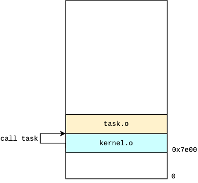
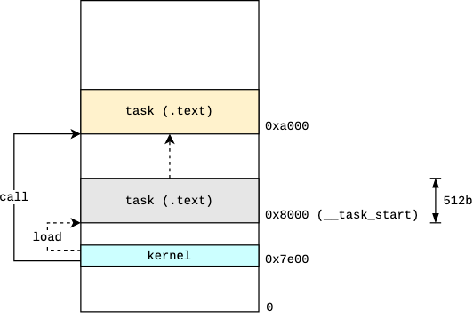

# Running a Task

Ultimately our operating system's job is to provide abstractions for users to develop and run their programs. To get there, we'll need to manage interrupts, memory, disk, keyboard, and display among other things. But instead of starting from those details and risk losing the forest for the trees, we'll start with our goal and build only what is necessary to make it happen.

### What is a task?

A task is a processing-oriented view of a program. When a program is built, it is just a static binary. To make it do something it needs to be loaded into memory and given control. While running, the task relies on operating system services to execute priviledged operations, such as reading from and writing to disk. It may communicate with other tasks as well to achieve a more complex goal. However, tasks are protected and isolated from each other, and the kernel is protected and isolated from all tasks.

### A Simple Task

The simplest way we can model a task at this early stage is through a plain C function that the kernel can call directly. We'll create a task function that displays the letter `T` on screen.

Before we implement the task function, let's add a function to clear the screen since it's still has the BIOS messages and it would much cleaner if we start with a blank screen.

```c
void clear_screen() {
    unsigned short* video_memory = (unsigned short*)VIDEO_MEMORY;
    for (int i = 0; i < (25 * 80); i++) {
        *(video_memory + i) = 0;
    }
}
```

This function just loops through text mode video memory (25 rows x 80 columns) and clears the characters. Now let's add the task function.

```c
// kernel.c

#define VIDEO_MEMORY       0xB8000
#define WHITE_ON_LIGHTBLUE 0x9F

void clear_screen();
void task();

void kmain() {
    clear_screen();

    unsigned short* video_memory = (unsigned short*)VIDEO_MEMORY;
    *(video_memory) = (WHITE_ON_LIGHTBLUE << 8) | 'K';

    task();

    asm("cli \n"
        "hlt");
}

void clear_screen() {
    unsigned short* video_memory = (unsigned short*)VIDEO_MEMORY;
    for (int i = 0; i < (25 * 80); i++) {
        *(video_memory + i) = 0;
    }
}

void task() {
    unsigned short* video_memory = (unsigned short*)VIDEO_MEMORY;
    *(video_memory + 80) = (WHITE_ON_LIGHTBLUE << 8) | 'T';
}
```

Notice that we put the `clear_screen` and `task` function definitions after the kernel entry point `kmain`. If we put any code before `kmain`, that's what the boot sector will jump to. So `kmain` has to be the first code in the compiled output.

The task function prints the character `T` at the beginning of the second line by adding `80` to the video memory address, and since the pointer is of type `unsigned short`, this translates to 160 bytes, which is what we want as there are two bytes per character on screen (ASCII + attributes). When we run this new kernel, we get the expected result:

```
K
T
```

### Kernel / Task Separation

So, while we were able to execute a simple task in the form of a function directly called by the kernel, it hardly resembles what a task should be. For starters it's running kernel mode and is accessing video memory directly. It's also directly embedded in the kernel. We're still far away from user mode tasks, but the least we can do is make tasks a bit more independent of the kernel itself.

Ideally we should be able to load a separately compiled task from disk into memory, and call it. It would still run in kernel mode for now, but it would be independent of the kernel.

#### Task as a Separate Module

Since we're also a bit far away from reading from disk, let's do a simpler thing. Let's compile the task as a separate module and link it to our kernel. Since our task uses consants defined in the kernel module, let's move them to a header file that we can include in both of them.

```c
// kernel.h

#define VIDEO_MEMORY       0xB8000
#define WHITE_ON_LIGHTBLUE 0x9F
```

```c
// task.c

#include "kernel.h"

void task() {
    unsigned short* video_memory = (unsigned short*)VIDEO_MEMORY;
    *(video_memory + 80) = (WHITE_ON_LIGHTBLUE << 8) | 'T';
}
```

```c
// kernel.c

#include "kernel.h"

extern void task();
void clear_screen();

void kmain() {
    clear_screen();

    unsigned short* video_memory = (unsigned short*)VIDEO_MEMORY;
    *(video_memory) = (WHITE_ON_LIGHTBLUE << 8) | 'K';

    task();

    asm("cli \n"
        "hlt");
}

void clear_screen() {
    unsigned short* video_memory = (unsigned short*)VIDEO_MEMORY;
    for (int i = 0; i < (25 * 80); i++) {
        *(video_memory + i) = 0;
    }
}
```

Notice that we declared the `task` function symbol as `external` to tell the compiler that it's defined somewhere else, and that the linker will take care of resolving the function call to the actual function address during linking.

Let's modify our `Makefile` to compile the new `task.c` module and link it to our kernel.

```makefile
NASM := nasm
GCC := i386-elf-gcc
LD := i386-elf-ld
QEMU := qemu-system-i386

CFLAGS := -g -fno-asynchronous-unwind-tables
LDFLAGS := --oformat=binary --entry=kmain 

os.img: bootsect.img kernel.img
	cat $^ > os.img

bootsect.img: bootsect.asm
	$(NASM) $< -o $@

kernel.o: kernel.c
	$(GCC) $(CFLAGS) -c $< -o $@

task.o: task.c
	$(GCC) $(CFLAGS) -c $< -o $@

kernel.img: kernel.o task.o
	$(LD) $(LDFLAGS) $^ -o $@

run: os.img
	$(QEMU) -nic none -drive file=$<,format=raw

clean:
	rm *.o *.img
```

We compile `task.c` to `task.o`, and link it _after_ `kernel.o` in the final output. Again, it's important that the kernel entry point be the first thing in the output (we'll make this less relevant later). If you test this you'll get the same output as before.

Although the task is defined in a separate module, the kernel knows its symbol name and still calls it directly.

#### Task as a Loadable Module

To get closer to actual loading and execution of tasks, we can pretend that a certain area of memory acts like disk storage and "load" tasks from it. We can leverage linker scripts to have control over the final memory layout of our code. In this case, we will create a section in the output dedicated to tasks, where each task is allocated a fixed size of 512 bytes.

So far we didn't have the need to create a linker script, so `ld` was basically copying all loadable sections from the input object modules to the output in the order they're specified on the command line; i.e. `kernel.o` followed by `task.o`. This is illustrated in the following diagram, where the kernel and task modules are loaded back-to-back, and the kernel directly calls the task by its function symbol.

<p align="center"> 
    
</p>

What we want to do instead is to assign two fixed-size 512b memory blocks, one for the kernel and another for the task[^1]. We will assign the symbol `__tasks_start` to the start address of the task block so that we can access it from our C kernel. The kernel will use that address to "load" a 512b block from there into a destination load address, and then calls the task at the load address. The following diagram illustrates this process.

[^1]: Obviously this is very limiting, but at this stage we're just building a proof of concept. Also, technically we don't have to pad the kernel to 512b, but it makes the memory addresses easier to recognize during debugging.

<p align="center"> 
    
</p>

Let's create the linker script to specify such a memory layout.

```
/* linker.ld */

SECTIONS
{
    .kernel 0x7e00 :
    {
        kernel.o (.text .data)
        . = ALIGN(512);
    }

    __tasks_start = .;
    .tasks :
    {
        task.o (.text .data)
        . = ALIGN(512);
    }
}
```

We create two output sections:
* A `.kernel` section which starts at address `0x7e00` (kernel entry point). This section contains the `.text` and `.data` sections from the `kernel.o` object file, and is padded to 512b.
* A `.tasks` section which starts after the padded kernel (i.e. at `0x8000`). Similar to the `.kernel` section, this section contains the `.text` and `.data` sections from the `task.o` object file, and is padded to 512b.

Before we forget, let's use tell `ld` to use this linker script instead of the default one.

```makefile
# Makefile

...

OBJECTS := kernel.o task.o

...

kernel.img: $(OBJECTS) linker.ld
	$(LD) $(LDFLAGS) $(OBJECTS) -T linker.ld -o $@
...
```

Since we want to pass `linker.ld` using the `-T` parameter, we can't use the `$^` automatic variable anymore; otherwise the `linker.ld` file will be added to the list of object files to be linked. Instead, we use a variable to hold the object file names and pass that intead.

Let's add a `load_task()` function to our kernel that will copy the task 512b block to a given destination address.

```c
// kernel.c

...

#define TASK_SIZE 512

extern uint8_t __tasks_start;
uint8_t* task_base = &__tasks_start;

void load_task(uint8_t* dest) {
    for (int i = 0; i < TASK_SIZE; i++) {
        dest[i] = task_base[i];
    }
}
```

In order to get the address of the symbol `__tasks_start`, we first need to tell the compiler that it's an external symbol using `extern uint8_t __tasks_start`. This is actually not a variable, but just a way to be able to refer to the symbol within the file. To get the _address_ of the symbol, we use the address operator `&`, i.e. `&__tasks_start`, and assign it to a pointer variable that we can use to access the section's content.

Now let's modify the `kmain()` function to call `load_task()` and then call the loaded task.

```c
#define TASK_LOAD_ADDR 0xa000
typedef void (*task_t)(void);

void clear_screen();
void load_task(uint8_t* dest);

void kmain() {
    clear_screen();

    unsigned short* video_memory = (unsigned short*)VIDEO_MEMORY;
    *(video_memory) = (WHITE_ON_LIGHTBLUE << 8) | 'K';

    load_task((uint8_t*)TASK_LOAD_ADDR);
    task_t task = (task_t)TASK_LOAD_ADDR;
    task();

    asm("cli \n"
        "hlt");
}
```

Notice that we declared a function pointer type called `task_t`, which we'll use to call the task at its destination load address. We ask `load_task()` to load the task at address `0xa000`, then we cast that address as `task_t`, then invoke the task via the function pointer.

If we did everything correctly, we should be able to run this and get the expected result from the task, i.e. the `T` character pritned on the second line.

```
$ make run
...
```
```
K
T
```

Success! 

### Recap

* We learned what a task is and implemented a few ways for the kernel to invoke a task.
* We created a simple task as a function that the kernel invokes through a direct call.
* We separated the task into a separately compiled module, and invoked it through a direct call as well.
* We implemented a way to "load" tasks from a separate section and invoked it through a function pointer.

### Next

Let's take our section-based task loading a step further and add support for storing multiple tasks in the `.tasks` section, and have the kernel load and execute tasks by their index in the section.
