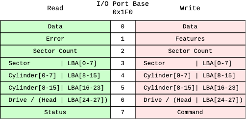

# Loading Tasks from Disk &mdash; Part 1

To further decouple tasks from the kernel, we're going to compile them separately, create a binary from their object output, and store them in the overall disk image after the kernel binary.

But before we get to that point, we'll need to write a simple disk driver that knows how to talk to the disk controller to load disk sectrs into memory. We were able to do this in real mode through a BIOS interrupt, but in protected mode we're on our own. Let's first learn what the disk interface looks like.

### Disk Interface

Modern disk technology is mostly Serial ATA (SATA), which uses AHCI (Advance Host Controller Interface) as an interface between the host and the device. Parallel ATA was the original interface prior to SATA, which can still be used with ACHI through a backward compatibility mode. In order to start with a simple implementation, we'll use the ATA interface.

#### ATA Interface

Communication with an ATA disk is done through a numbrer of I/O ports following a specific protocol. It's important to be familiar with those ports and what their purpose is. The following figure illustrates those ports.

<p align="center"> 
    
</p>

There are 8 ports, with the base address `0x1F0` and going up to `0x1F7` for the primary ATA controller (the secondary controller's base port is usually at `0x170`). Some of the ports have different meaning when read from vs. when written to. For example, port `0x1F7` is used for sending a **Command** by writing to it, and is used for reading the **Status** by reading from it.

An ATA bus can have two drives attached to it, called Drive 0 and Drive 1. Commands are sent to a drive by setting certain parameters in different ports, including the target drive, then sending the command to **Command** port `0x1F7`. Upon completion of the command, the **Status** port should be checked for any errors. If the command succeeded, the data would be available for reading through the **Data** port `0x1F0`.

#### Addressing modes

Addressing sectors on the disk can be done in two modes: **CHS** (Cylinder/Head/Sector) or **LBA** (Logical Block Addressing). CHS requires knowning the drive geometry; it is an old addressing scheme that is not used anymore. LBA treats sectors on a disk as a linear list of blocks starting at block 0. It is supported by all drives nowadays.

#### Data transfer modes

This mode of operation is called **PIO** (Programmed I/O). It is less efficient than other modes since it requires the processor to poll the status until the command completes, and then read the data one word at a time. A more efficient mode of opeartion is using **interrupts**, where after issuing the command, the CPU can continue doing other work, and when the command completes an interrupt will be raised to handle transferring the data. An even more efficient mode of operation is using **DMA** (Direct Memory Access), in which the CPU delegates data transfer to a DMA controller. The DMA controller then transfers the data from the drive directly to memory, and only notifying the CPU through an interrupt when the data transfer is done.

### Reading disk sectors

We're going to use PIO for now, since we haven't setup interrupts yet. To load sectors from an ATA disk, we need to follow the following steps:

1. Check the `BSY` bit of the Status register and wait for it to be clear.
2. Set the 28-bit LBA address of the starting sector through the LBA address registers.
3. As part of setting the `LBA[24-27]` part of the LBA address, we also need to set the drive number (typically 0) and set the `L` bit (for LBA mode) through the same register.
4. Set the number of sectors to read through port Sector Count register.
5. Send the "Read sector(s)" command `0x20` to the Command register.
6. Check the `BSY` bit of the Status register and wait for it to be clear.
7. Check the `ERR` flag of the Status register. If set, read the Error register to get more details on the error and stop.
9.  Ensure the `DRQ` (data request) flag in the Status register is set. This means data is available to be read.
10. Read 512 sector bytes by reading 256 16-bit words from the Data register.
11. If there are more sectors to read, go to step 7.

Let's create a new module called `ata.c` to code this. Let's first define the interface in `ata.h`.

```c
// ata.h

int read_sectors(uint32_t start, size_t count, uint32_t* dest);
```

The `read_sectors` function takes the `start` sector, a sector `count`, and a pointer to a `dest` buffer big enough to hold `512 * count` bytes. It returns the number of sectors actually read.

```c
// ata.c

#include <stddef.h>
#include <stdint.h>
#include "port.h"

#define ATA0_BASE         0x1F0

#define REG_DATA          0
#define REG_ERROR         1
#define REG_FEATURES      1
#define REG_SECTOR_COUNT  2
#define REG_LBA_00        3
#define REG_LBA_08        4
#define REG_LBA_16        5
#define REG_LBA_24        6
#define REG_STATUS        7
#define REG_COMMAND       7

#define FLAG_LBA          0b01000000
#define FLAG_DRV1         0b00010000

#define CMD_READ_SECTORS  0x20
#define STATUS_BUSY       0x80
#define STATUS_DRQ        0x08
#define STATUS_ERR        0x01

void wait_on_busy() {
    uint8_t busy = port_in8(ATA0_BASE + REG_STATUS) & STATUS_BUSY;
    while (busy) {
        asm("pause"::);
        busy = port_in8(ATA0_BASE + REG_STATUS) & STATUS_BUSY;
    };
}

int read_sectors(uint32_t start, size_t count, uint32_t* dest) {
    wait_on_busy();

    // send LBA block address
    port_out8(ATA0_BASE + REG_LBA_00, (uint8_t)start);
    port_out8(ATA0_BASE + REG_LBA_08, (uint8_t)(start >> 8));
    port_out8(ATA0_BASE + REG_LBA_16, (uint8_t)(start >> 16));
    port_out8(ATA0_BASE + REG_LBA_24, (uint8_t)(start >> 24 | FLAG_LBA));
    // send sector count
    port_out8(ATA0_BASE + REG_SECTOR_COUNT, count);
    // send command
    port_out8(ATA0_BASE + REG_COMMAND, CMD_READ_SECTORS);

    // read sectors
    size_t read_count = 0;
    uint16_t* ptr = (uint16_t*)dest;
    for (int c = 0; c < count; c++) {
        wait_on_busy();

        uint8_t status = port_in8(ATA0_BASE + REG_STATUS);
        if (status & STATUS_ERR) {
            // ideally we should read the Error register for more details
            break;
        }
        if ((status & STATUS_DRQ) == 0) {
            // this shouldn't happen; we may handle this differently later
            break;
        }
        // read sector's data in 16-bit words
        for (int i = 0; i < 256; i++, ptr++) {
            *ptr = port_in16(ATA0_BASE + REG_DATA);
        }
        read_count++;
    }

    return read_count;
}
```

Hopefully the code is self-explantory. Notice that I'm calling port reading/writing functions that are declared in `port.h`, which is another module we'll need to create since we'll need those port functions for other purposes later.

```c
// port.h

#pragma once

#include <stdint.h>

void port_out8(uint16_t port, uint8_t byte);
void port_out16(uint16_t port, uint16_t word);

uint8_t port_in8(uint16_t port);
uint16_t port_in16(uint16_t port);
```

```c
#include <stdint.h>

void port_out8(uint16_t port, uint8_t byte) {
    asm("out dx, al"
        : // no output data
        : "Nd"(port), "a"(byte));
}

void port_out16(uint16_t port, uint16_t word) {
    asm("out dx, ax"
        : // no output data
        : "Nd"(port), "a"(word));
}

uint8_t port_in8(uint16_t port) {
    uint8_t byte;
    asm("in ax, dx"
        : "=a"(byte)
        : "Nd"(port));
    return byte;
}

uint16_t port_in16(uint16_t port) {
    uint16_t word;
    asm("inw ax, dx"
        : "=a"(word)
        : "Nd"(port));
    return word;
}
```

I'm using Intel syntax for inline assembly, which is not the default in GCC. The default for inline assembly in GCC is AT&T syntax, but I'm overriding it by adding the `-masm=intel` argument to the `CFLAGS` variable in the `Makefile`.

Let's add those two new modules to the `Makefile`.

```makefile
# Makefile

...

SRCS = kernel.c console.c cpu.c task.c port.c ata.c task_a.c task_b.c

...
```

Now let's use the new `read_sectors` function in our kernel to read the first sector (i.e. the boot sector) into memory and make sure it works.

```c
// kernel.c

...

void kmain() {
    ...

    read_sectors(0 /* start */, 1 /* count */, (uint32_t*)0xf000);

    halt();
}
```

Let's try this out.

```
$ make run
...
(qemu) xp /8i 0xf000
0x0000f000:  b4 0e                    movb     $0xe, %ah
0x0000f002:  b0 42                    movb     $0x42, %al
0x0000f004:  cd 10                    int      $0x10
0x0000f006:  b4 02                    movb     $2, %ah
0x0000f008:  b0 10                    movb     $0x10, %al
0x0000f00a:  b5 00                    movb     $0, %ch
0x0000f00c:  b1 02                    movb     $2, %cl
0x0000f00e:  b6 00                    movb     $0, %dh
```

I'm inspecting the memory where we loaded the first (boot) sector. The disassembled instructions look familiar, but let's compare those first bytes to the actual data stored in the disk image to make sure.

```
$ xxd -l 16 os.img
00000000: b40e b042 cd10 b402 b010 b500 b102 b600  ...B............
```

Looks like they match. We have successfully loaded a sector from disk into memory!

### Loading and executing tasks

Now that we're able to load disk sectors, let's load the sectors containing the two tasks and execute them. First, we need to know which sectors contain the two tasks. Fortunately we have everything aligned at 512 bytes, which is the sector size, so our various parts of the disk image start and end on sector boundaries. Our boot sector is 1 sector in size, and so is each of task a and task b. The kernel binary has grown over time, so let's check its size to see how many sectors it's taking. We still have the two tasks linked in the kernel binary, so we'll need to exclude their size to find the actual kernel binary size.

```
$ wc -l kernel.bin
    2560 kernel.bin
```

So, knowing that the two tasks are taking 1024 bytes at the end of this binary, we can conclude that the kernel size is 1536 bytes, or 3 sectors. Given this information, let's take a look at our current disk image layout.

```
  sector        contents
+--------+-----------------------+
|   0    | boot sector           |
+--------+-----------------------+
|   1    |                       |
|   2    | kernel                |
|   3    |                       |
+--------+-----------------------+
|   4    | task_a                |
+--------+-----------------------+
|   5    | task_b                |
+--------+-----------------------+
```

So, theoretically if we load sector 4 (for task_a) and sector 5 (for task_b) and execute them, we should get the expected messages "Task A" and "Task B" on screen. Let's try that.

```c
// kernel.c

...

#include "ata.h"

typedef void (*task_t)(void);

void kmain() {
    clear_screen();

    print("Booting kernel...");

    uint32_t* load_addr = (uint32_t*)0xf000;

    {
        read_sectors(4 /* start */, 1 /* count */, load_addr);
        task_t task = (task_t)load_addr;
        task();
    }

    {
        read_sectors(5 /* start */, 1 /* count */, load_addr);
        task_t task = (task_t)load_addr;
        task();
    }

    halt();
}
```

Let's try it.

```
Booting kernel...
Task A
Task B
```

Success!

### Recap

* We learned about the ATA disk interface, its ports, programming modes, and addressing modes.
* We implemented a simple disk driver that can read sectors from disk.
* We loaded a disk sector into memory and verified that our driver works.
* We used this new functionality to load the sectors of our tasks into memory and executed them.

### Next

We still have our tasks linked to the kernel, which makes them still tightly coupled. Our next step is to compile and link each task separately to remove the compile/link-time dependency on the kernel. In order to do this we'll have to find another way to call kernel functions.
