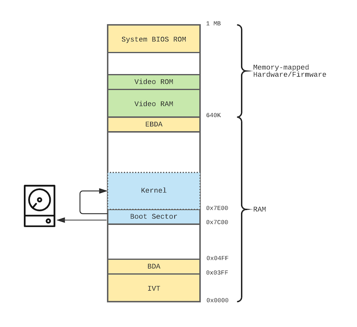

# Loading a Dummy Kernel

We have a way to execute a simple boot sector, but it would be futile to build a kernel in just 512 bytes. We need to start thinking about loading a kernel image from disk and transferring control to it. This is our second time communicating with a hardware device, and again we'll rely on the BIOS to help us read from disk.

Before we go into the details of calling the BIOS to load our kernel, let's take another look at the memory layout and where the boot sector and the kernel fits in the overall picture (memory areas are not to scale).



The accessible RAM in real-mode is 640K; the area between 640K and 1MB is for memory-mapped hardware/firmware (such as video RAM/ROM and the BIOS ROM). The start of the RAM contains the IVT and the BDA, taking north of 1K. The end of the RAM (just below 640K) contains the EBDA, which is typically 1K in size. Our boot sector is loaded at address `0x7C00` (about 31K into memory). This leaves two areas of free memory for us: about 30K below the boot sector, and about 608K above it. Technically we can think of it as one big area that is 638K in size if we ignore the boot sector, but we'll need to keep the boot sector intact util the kernel is fully loaded into memory[^1]. Let's use the area above the boot sector since it is bigger. Our goal then is to load our kernel immediately after the boot sector, i.e. at `0x7E00`.

We need a few things:
* a dummy kernel image that does something similar to our simple boot sector to tell us it is working (i.e. display a character on screen),
* add the dummy kernel image to the overall QEMU disk image, and
* a way to ask the BIOS to load the kernel from the disk image into memory.

### Create a dummy kernel

Let's copy our boot sector code to a new file and modify a bit to be our dummy kernel[^2]:

[^2]: Once we start declaring and referring to symbols in our kernel, we'll need to let the assembler know its origin address, i.e. set the `org` directive. I'm leaving this out until we need it.

```
;   kernel.asm

    mov    ah, 0x0E              ; tty mode
    mov    al, 'K'
    int    0x10

    cli
    hlt
```

This will just output the character `K` to screen and halt the CPU. Let's assemble this to generate our dummy kernel image:

```
$ nasm -o kernel.img kernel.asm
$ xxd -a kernel.img
00000000: b40e b04b cd10 faf4                      ...K....
```

### Add the dummy kernel to the disk image

We now have two separate images: the boot sector image (512 bytes), and the dummy kernel image (512 bytes). We need to append the kernel image after the boot sector image to generate a single disk image for QEMU to use. A simple `cat` should do.

```
$ cat bootsect.img kernel.img > os.img
$ xxd -a os.img
00000000: b40e b042 cd10 b402 b001 b500 b102 b600  ...B............
00000010: b280 bb00 7ecd 13ea 007e 0000 faf4 0000  ....~....~......
00000020: 0000 0000 0000 0000 0000 0000 0000 0000  ................
*
000001f0: 0000 0000 0000 0000 0000 0000 0000 55aa  ..............U.
00000200: b40e b04b cd10 faf4                      ...K....
```

### Load the dummy kernel

Now we need to lean on the BIOS to load that kernel image into memory for us. The interrupt responsible for disk I/O services is [`INT 13h`](https://stanislavs.org/helppc/int_13.html). This interrupt offers many disk I/O routines; the one we're interested in is `INT 13,02` [Read Disk Sectors](https://stanislavs.org/helppc/int_13-2.html):

```
INT 13,2 - Read Disk Sectors

	AH = 02
	AL = number of sectors to read	(1-128 dec.)
	CH = track/cylinder number  (0-1023 dec., see below)
	CL = sector number  (1-17 dec.)
	DH = head number  (0-15 dec.)
	DL = drive number (0=A:, 1=2nd floppy, 80h=drive 0, 81h=drive 1)
	ES:BX = pointer to buffer


	on return:
	AH = status  (see INT 13,STATUS)
	AL = number of sectors read
	CF = 0 if successful
	   = 1 if error

  ...
	- the parameters in CX change depending on the number of cylinders;
	  the track/cylinder number is a 10 bit value taken from the 2 high
	  order bits of CL and the 8 bits in CH (low order 8 bits of track):

	  |F|E|D|C|B|A|9|8|7|6|5-0|  CX
	   | | | | | | | | | |	`-----	sector number
	   | | | | | | | | `---------  high order 2 bits of track/cylinder
	   `------------------------  low order 8 bits of track/cyl number
```

Basically this interrupt relies on passing the coordinates of the starting sector (drive, cylinder/track, head, and sector), how many sectors to load, and the destination memory address. Our kernel is only one sector in size so far, and is located on the second sector of the disk image. The BIOS will let us know how many sectors were actually read (`al` register), and if anything went wrong (carray flag `cf` will be set and `ah` will contain the status code).

One restriction in this interrupt routine is that size of the loaded data must fit within the destination segment boundary, i.e. `BX + (data size) <= 0xFFFF`. Since we can specify the same destination address in many different `segment:offset` combinations, this shouldn't be a problem for us. We'd like to load our kernel at `0x07E00`; if we use the address `0000:7E00` that will allow us to load a kernel up to ~32K in size, which is more than enough. If we want to load up to 64K (which is the maximum we can load in one call), we'll need to use an address that has an offset = `0x0000`, i.e. `0x07E0:0000`.

Let's modify our boot sector to load the dummy kernel:

```
;   bootsect.asm

    ;
    ; output 'B' to screen
    ;
    mov    ah, 0x0E              ; tty mode
    mov    al, 'B'
    int    0x10

    ;
    ; load a one-sector dummy kernel
    ;
    mov    ah, 2                 ; INT 13,2 Read Disk Sectors
    mov    al, 1                 ; read one sector
    mov    ch, 0                 ; first track/cylinder
    mov    cl, 2                 ; second sector (sector numbers are 1-based)
    mov    dh, 0                 ; first head
    mov    dl, 0x80              ; drive number, 80h=drive 0
    mov    bx, 0x7E00            ; es:bx = 0x0000:0x7E00 = 0x07E00
    int    0x13

    ;
    ; halt
    ;
    cli
    hlt

    times 510-($-$$) db 0
    db     0x55, 0xAA
```

Let's assemble and test it:

```
$ nasm -o bootsect.img bootsect.asm
$ cat bootsect.img kernel.img > os.img
$ qemu -drive file=os.img,format=raw
```
```
Booting from Hard Disk...
B
```

We haven't transferred control to the kernel yet, so we won't see the `K` character printed yet. We can, however, check a `INT 13h` return registers through QEMU to make sure the kernel sector was loaded correctly:

```
(qemu) xp $eflags
0000000000000002: 0xff53f000
(qemu) xp $eax
0000000000000001: 0x53f000ff
```

The carry flag is bit-0 in the `eflags` register, which we can see is reset (bit-1 is reserved and is always set). The `ah` (high-order half of `eax`) is zero, which indicates "no error", while `al` is 1 indicating that one sector has been read. Obviously we should make the code more robust by checking for and handling errors, but let's worry about this a bit later.

Let's check the memory area at `0x7E00` (the `/5i` is a format specifier that tells QEMU to dump 5 memory items as assembly instructions instead of data):

```
(qemu) xp /5i 0x7e00
0x00007e00:  b4 0e                    movb    $0xe, %ah
0x00007e00:  b0 4b                    movb    $0x4b, %al
0x00007e00:  cd 10                    int     $0x10
0x00007e00:  fa                       cli
0x00007e00:  f4                       hlt
```

That's our dummy kernel code![^3]

### Transfer control to the kernel

Everything is in place for our kernel to start executing. We just need to jump to its starting address and let it take over.

```
    ...
    mov    bx, 0x7E00            ; es:bx = 0x0000:0x7E00 = 0x07E00
    int    0x13

    ;
    ; jump to kernel
    ;
    jmp    word 0x0000:0x7E00

    ...
```

This is called a "far jump" (as opposed to a "near jump"), since we're specifying the absolute address to jump to as a segment:offset. Far jumps can be done using either a `ptr16:ptr16` or `ptr16:ptr32` immediate operands (in addition to their indirect memory versions). Since we're using a `ptr16:ptr16` address, we need to tell NASM which operand size to use by specifying the `word` operand size specifier (the other being `dword` for `ptr16:ptr32`).

Let's test it:

```
$ nasm -o bootsect.img bootsect.asm
$ cat bootsect.img kernel.img > os.img
$ qemu -drive file=os.img,format=raw
```
```
Booting from Hard Disk...
BK
```

There's our `K` character printed by the dummy kernel! (Remember that the `B` character was printed by the boot sector).

Let's recap:
* We learned a bit more about the memory layout in real mode and explored the free memory areas where we can load our kernel.
* We created a one-sector dummy kernel to be loaded by the boot sector.
* We combined the boot sector image with the kernel image into one disk image.
* We learned how to use BIOS `INT 13h` to load the kernel's sector from disk.
* We learned how to manually check that our disk load succeeded using the QEMU monitor.
* We transferred control to our dummy kernel using a far jump instruction.

Next:
* It would be nice now to start writing our kernel in a higher level language such as C. But there are some issues with 16-bit real mode that makes writing a kernel in 16-bit really challenging. We're going to look next at what we can do about this.

*[IVT]: Interrupt Vector Table
*[BDA]: BIOS Data Area
*[EBDA]: Extended BIOS Data Area

[^1]: We can load a small second stage boot loader at the either boundary of the free memory area, which can load our kernel into a larger contiguous memory area. But it's not worth it at this point since our kernel will be small enough in the beginning.
[^3]: The syntax of the instructions looks a bit different because QEMU diassembles instructions the AT&T syntax, while we have been using the Intel syntax.